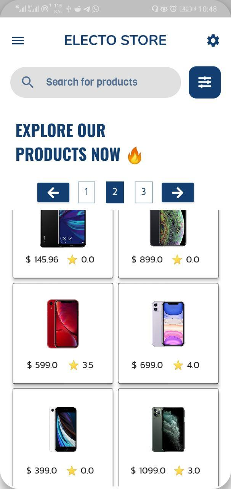
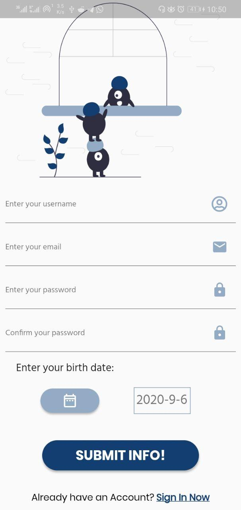
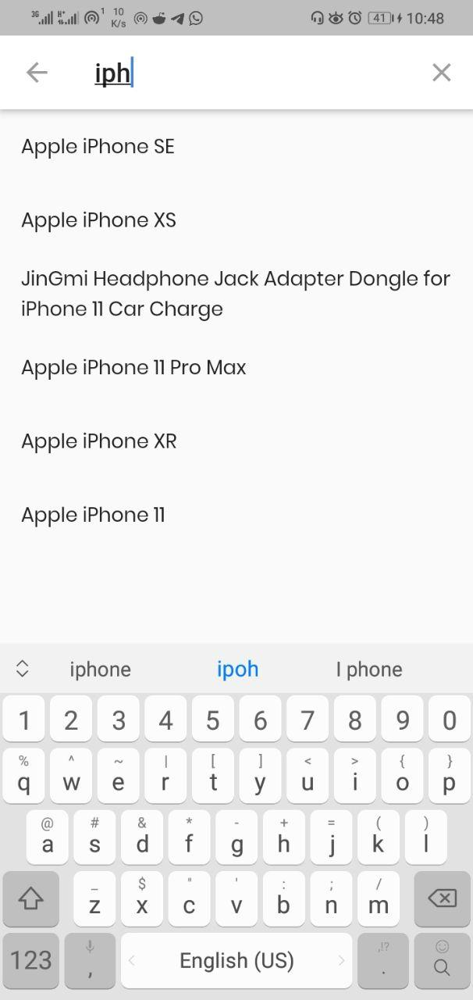
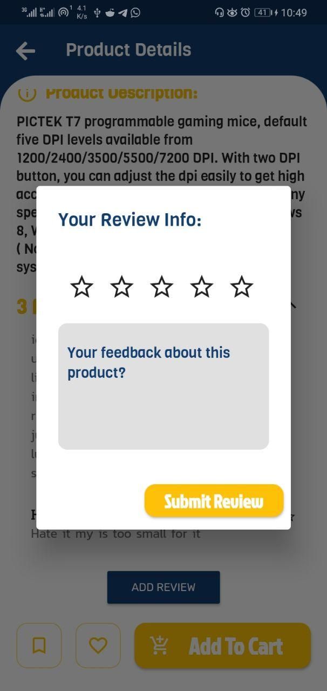
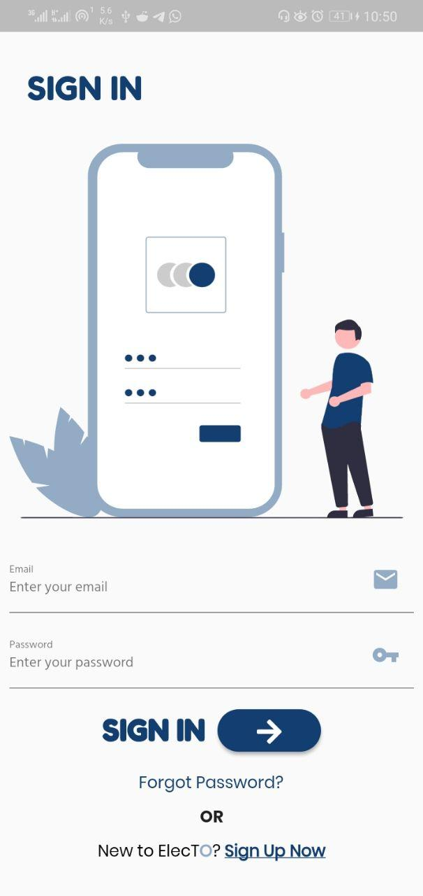
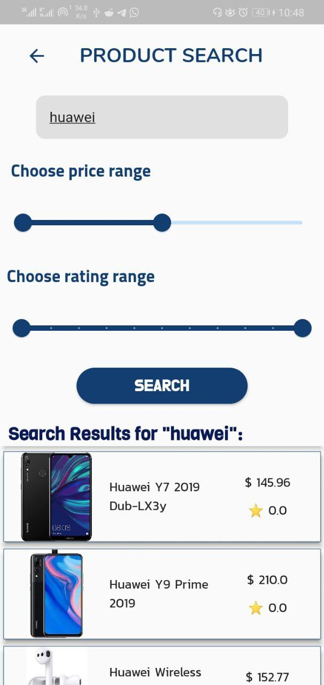
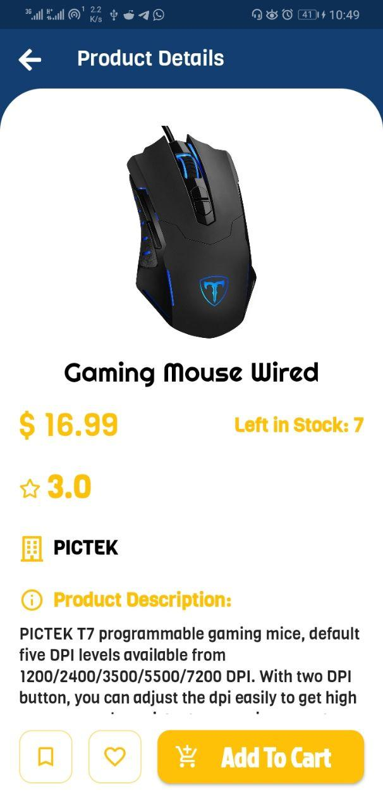
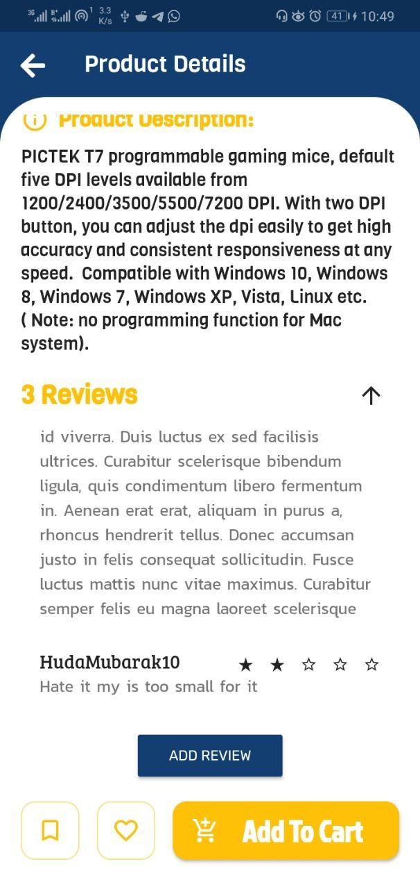

# Electronics Store App 
The app built with Flutter for Frontend and Node.js with Express.js for Backend, check the code for Backend [here](https://github.com/AsimZz/Electronics-Store-Api)


## Main Features

- BLoC patterns and Flutter Hooks for state management.
- Node.js for handling the authentication,creating new users,adding users reviews and more more functions.
- MongoDB Atlas Search(The $search Aggregation Pipeline Stage) to handle the functionality of searching for specific product with specific info,for more info check the documentation with examples [here](https://docs.atlas.mongodb.com/reference/atlas-search/query-syntax/)
- The DDD(domain driven design) design principle used to make the code more cleaner.
- I tried to handle the Logic outside the presentation layer as possiple as I could.

## Main Packages 

- flutter_bloc & flutter_hooks for state management.
- injection, injection_generator and getIt for dependency injection.
- freezed(my favorite one xD) for data classes and union cases.
- shared_preferences for local storage database.

## What left to implement?
- Favorite & bookmaring products buttons.
- Adding to Cart and managing orders pages.
- Update user Info Page.
- Settings page also not implement yet.

all these features and more will be implement soon.

## Install Packages

```
flutter pub get

Then run build_runner command for code generation: 

flutter pub run build_runner build

```

## Run The App and have fun

```
flutter run
```


- Author: Asim Abdalla
- if you like this please star ⭐ it and follow me.
- Contact me at asimabdalla99@gmail.com for a Job or anything.

## Screenshots from the App:
  
  
  


